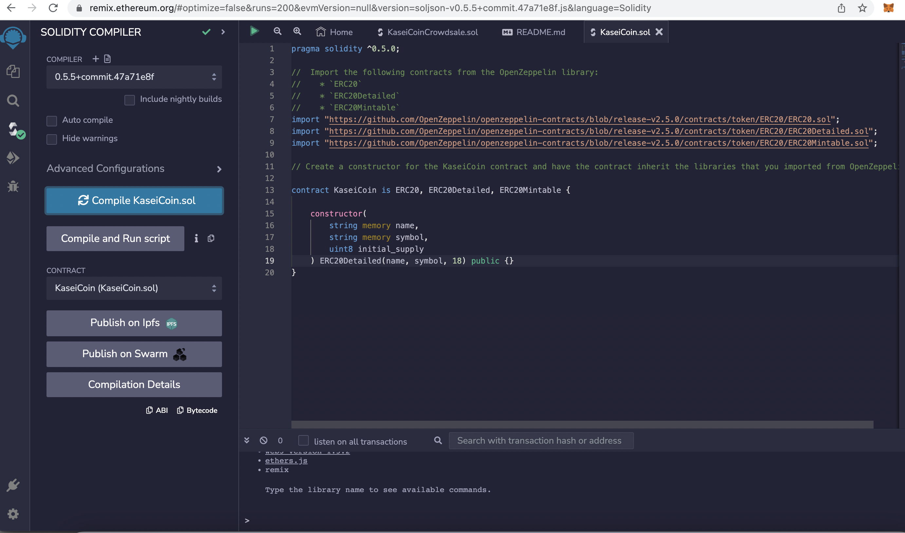
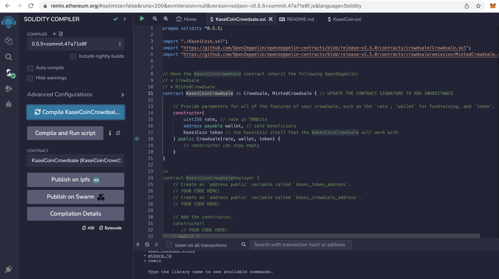
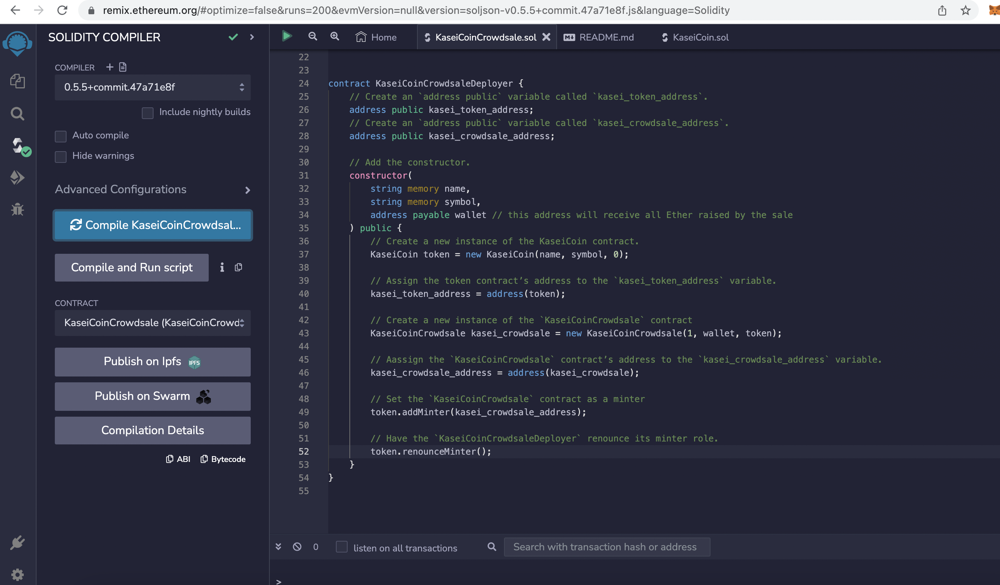
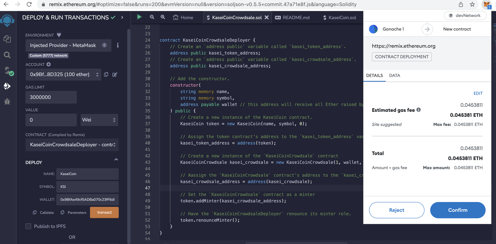
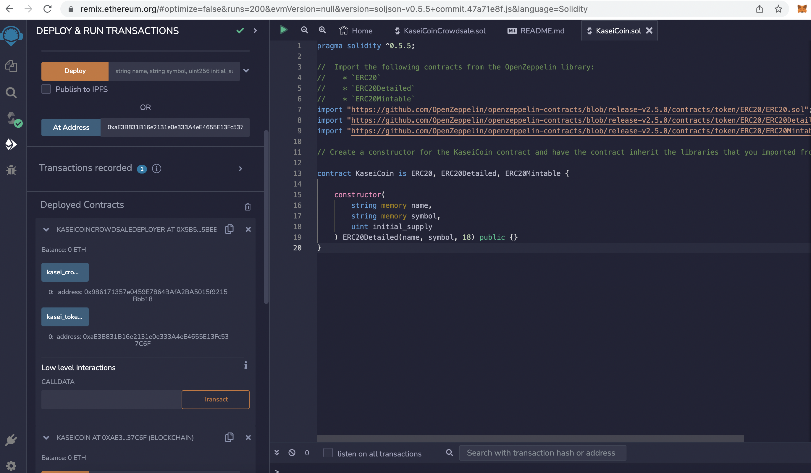
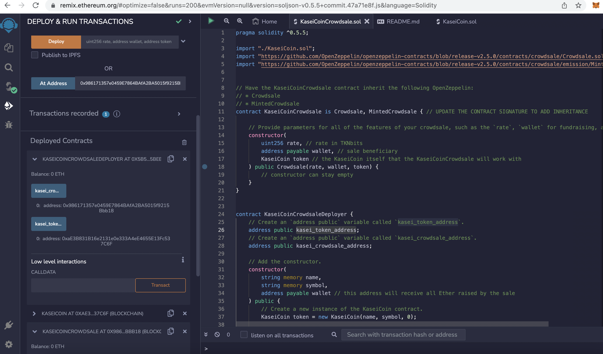
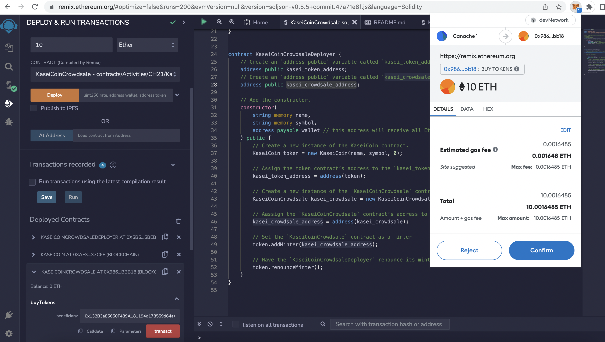

# fungible_token_ERC20

The **fungible_token_ERC20** creates fungible token that is ERC-20 compliant and that will be minted by using a Crowdsale contract from the OpenZeppelin Solidity library. The crowdsale contract manages the entire crowdsale process, allowing users to send ether to the contract and in return receive KAI, or KaseiCoin tokens. The ontract will mint the tokens automatically and distribute them to buyers in one transaction.


---

## Technologies

This project leverages solidity with the following packages:

* [Solidity](https://soliditylang.org/) - For creating the ethereum smart contract
* [Remix - Ethereum IDE](https://remix.ethereum.org) - For compiling and deploying the ethereum smart contract 
* [Metamask](https://metamask.io/) - For crypto wallet 
* [Ganache](https://trufflesuite.com/docs/ganache/) - Ethereum simulator that makes developing Ethereum applications faster, easier, and safe 


---

## Installation Guide

Use Remix Ethereum IDE to compile and deploy the ethereum smart contract 

---


## Usage

To use the **fungible_token_ERC20**  application simply clone , use Remix Ethereum IDE to compile and deploy the smart contract

```python
    Use Remix Ethereum IDE to compile and deploy the ethereum smart contract 
```


## Evaluation Evidence

1_Compiled_KaseiCoin_Contract



2_Compiled_KaseiCoinCrowdsale_Contract



3_Compiled_KaseiCoinCrowdsaleDeployer_Contract



4_Deployed_KaseiCoinCrowdsaleDeployer_with_MetaMask



5_Deployed_KaseiCoin_at_kasei_token_address_generated_from_KaseiCoinCrowdsaleDeployer_Contract



6_Deployed_KaseiCoinCrowdsale_at_kasei_crowdsale_address_generated_from_KaseiCoinCrowdsaleDeployer_Contract



7_buyTokens_for_10ETH



---

## Contributors

Kausar Hina

---

## License

MIT


